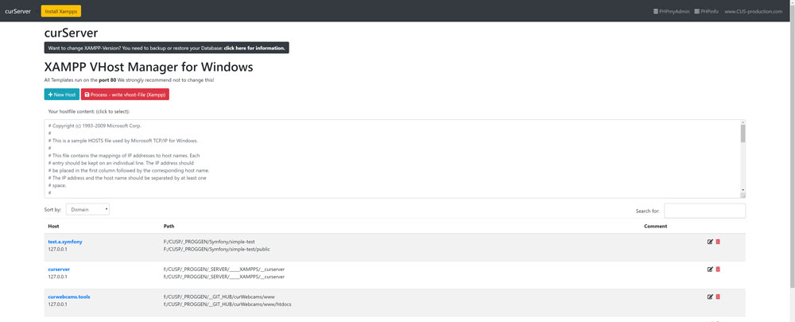

# VHost - Manager for Windows XAMPP

This tool helps you to manage your local vhosts (Domains) with different XAMPP-Versions.

You can easily add, delete or change domains on your system. For all Xampp-Versions for the same time.

